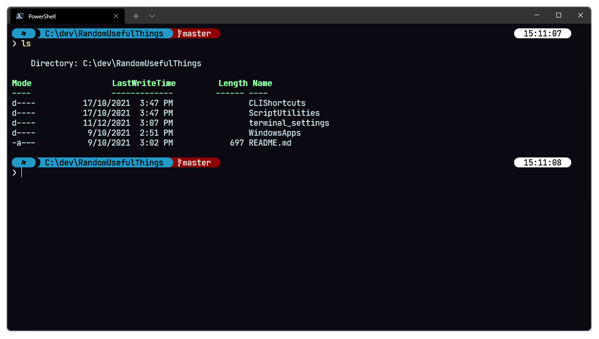

## Purpose

This document contains settings for Windows Terminal, coupled with Oh-My-Posh, to provide something that looks like this:



### Oh-My-Posh

[Oh-My-Posh](https://ohmyposh.dev/docs/windows) details how to install the Terminal modifier.

As a tl;dr, the following was done:

1. Use Winget to install oh-my-posh
```
winget install JanDeDobbeleer.OhMyPosh
```
2. Edit $PROFILE and insert the following:
```
oh-my-posh --init --shell pwsh --config ~/jandedobbeleer.omp.json | Invoke-Expression
```

### Nerd Font

A Nerd Font is required to faciltiate most Oh-My-Posh themes. I've used [JetBrainsMono](https://github.com/ryanoasis/nerd-fonts/releases/download/v2.1.0/JetBrainsMono.zip)

You can find others at [NerdFonts](https://www.nerdfonts.com/font-downloads)

### Terminal Colour Scheme

I've used the following terminal colour scheme:

```
{
  "background": "#0b0a13",
  "black": "#141228",
  "blue": "#65B2FF",
  "brightBlack": "#565575",
  "brightBlue": "#91DDFF",
  "brightCyan": "#AAFFE4",
  "brightGreen": "#95FFA4",
  "brightPurple": "#C991E1",
  "brightRed": "#FF8080",
  "brightWhite": "#CBE3E7",
  "brightYellow": "#FFE9AA",
  "cursorColor": "#FFFFFF",
  "cyan": "#63F2F1",
  "foreground": "#CBE1E7",
  "green": "#62D196",
  "name": "ChallengerDeep",
  "purple": "#906CFF",
  "red": "#FF5458",
  "selectionBackground": "#FFFFFF",
  "white": "#A6B3CC",
  "yellow": "#FFB378"
}
```

### Custom Oh My Posh Themes.

I'm using a modified version of the Powerlevel10k_modern theme that comes with oh-my-posh. Refer to: [powerlevel10k_modded](.\powerlevel10k_modded.omp.json) 

Profiles are located (by default) under: `~\AppData\Local\Programs\oh-my-posh\themes\` but they can theoretically be anywhere - just update the PowerShell `$PROFILE` to point to the correct location.

### VSCode Font

So you've set all this up for PowerShell but now VSCode doesn't render correctly? The integrated terminal just needs to have it's font updated.

1. Open the VSCode `settings.json`
2. Append the following line to the JSON configuration:
```
"terminal.integrated.fontFamily": "JetBrainsMonoMedium Nerd Font Mono",
```

**Note:** Substitute the font family for the one you're using.
